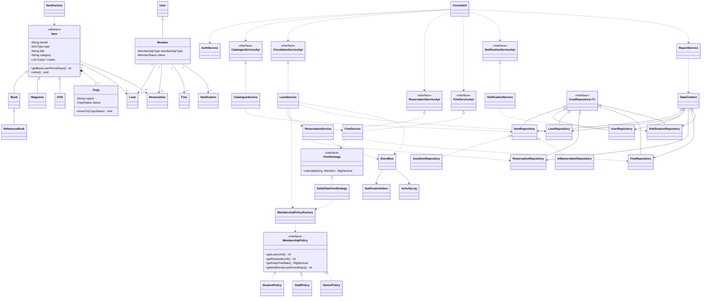

# Class diagram

```mermaid
classDiagram
    class Item {
        <<abstract>>
        -String itemId
        -ItemType type
        -String title
        -String category
        -List~Copy~ copies
        +getBaseLoanPeriodDays()* int
        +retire() void
    }
    class Book
    class Magazine
    class DVD
    class ReferenceBook
    class Copy {
        -String copyId
        -CopyStatus status
        +moveTo(CopyStatus) void
    }
    Item <|-- Book
    Book <|-- ReferenceBook
    Item <|-- Magazine
    Item <|-- DVD
    Item "1" *-- "1..*" Copy

    class User
    class Member {
        -MembershipType membershipType
        -MemberStatus status
    }
    User <|-- Member

    class MembershipPolicy {
        <<interface>>
        +getLoanLimit() int
        +getRenewalLimit() int
        +getDailyFineRate() BigDecimal
        +getAdditionalLoanPeriodDays() int
    }
    class StudentPolicy
    class StaffPolicy
    class SeniorPolicy
    MembershipPolicy <|.. StudentPolicy
    MembershipPolicy <|.. StaffPolicy
    MembershipPolicy <|.. SeniorPolicy
    class MembershipPolicyFactory
    MembershipPolicyFactory ..> MembershipPolicy
    class ItemFactory
    ItemFactory ..> Item

    class FineStrategy {
        <<interface>>
        +calculate(long, Member) BigDecimal
    }
    class DailyRateFineStrategy
    FineStrategy <|.. DailyRateFineStrategy
    DailyRateFineStrategy ..> MembershipPolicyFactory

    class Loan
    class Reservation
    class Fine
    class Notification
    Member "1" --> "0..*" Loan
    Item "1" --> "0..*" Loan
    Member "1" --> "0..*" Reservation
    Item "1" --> "0..*" Reservation
    Member "1" --> "0..*" Fine
    Member "1" --> "0..*" Notification

    class CatalogueServiceApi {
        <<interface>>
    }
    class CatalogueService
    CatalogueServiceApi <|.. CatalogueService
    class CirculationServiceApi {
        <<interface>>
    }
    class LoanService
    CirculationServiceApi <|.. LoanService
    class ReservationServiceApi {
        <<interface>>
    }
    class ReservationService
    ReservationServiceApi <|.. ReservationService
    class FineServiceApi {
        <<interface>>
    }
    class FineService
    FineServiceApi <|.. FineService
    class NotificationServiceApi {
        <<interface>>
    }
    class NotificationService
    NotificationServiceApi <|.. NotificationService
    class AuthService
    class ReportService
    LoanService ..> FineService
    LoanService ..> ReservationService
    LoanService ..> MembershipPolicyFactory
    FineService ..> FineStrategy

    class CrudRepository~T~ {
        <<interface>>
    }
    class ItemRepository
    class UserRepository
    class LoanRepository
    class ReservationRepository
    class FineRepository
    class NotificationRepository
    CrudRepository <|-- ItemRepository
    CrudRepository <|-- UserRepository
    CrudRepository <|-- LoanRepository
    CrudRepository <|-- ReservationRepository
    CrudRepository <|-- FineRepository
    CrudRepository <|-- NotificationRepository
    class DataContext
    DataContext o--> ItemRepository
    DataContext o--> UserRepository
    DataContext o--> LoanRepository
    DataContext o--> ReservationRepository
    DataContext o--> FineRepository
    DataContext o--> NotificationRepository
    CatalogueService ..> ItemRepository
    LoanService ..> LoanRepository
    ReservationService ..> ReservationRepository
    FineService ..> FineRepository
    ReportService ..> DataContext
    class JsonItemRepository
    class InMemoryItemRepository
    ItemRepository <|.. JsonItemRepository
    ItemRepository <|.. InMemoryItemRepository
    NotificationService ..> NotificationRepository

    class ConsoleUI
    ConsoleUI ..> AuthService
    ConsoleUI ..> CatalogueServiceApi
    ConsoleUI ..> CirculationServiceApi
    ConsoleUI ..> ReservationServiceApi
    ConsoleUI ..> FineServiceApi
    ConsoleUI ..> NotificationServiceApi
    ConsoleUI ..> ReportService

    class EventBus
    class NotificationInbox
    class ActivityLog
    EventBus --> NotificationInbox
    EventBus --> ActivityLog
    LoanService ..> EventBus
    ReservationService ..> EventBus
```

`Main` is the composition root: it creates the JSON-backed `DataContext`, registers the event listeners, builds the services, and injects their APIs into `ConsoleUI`.
